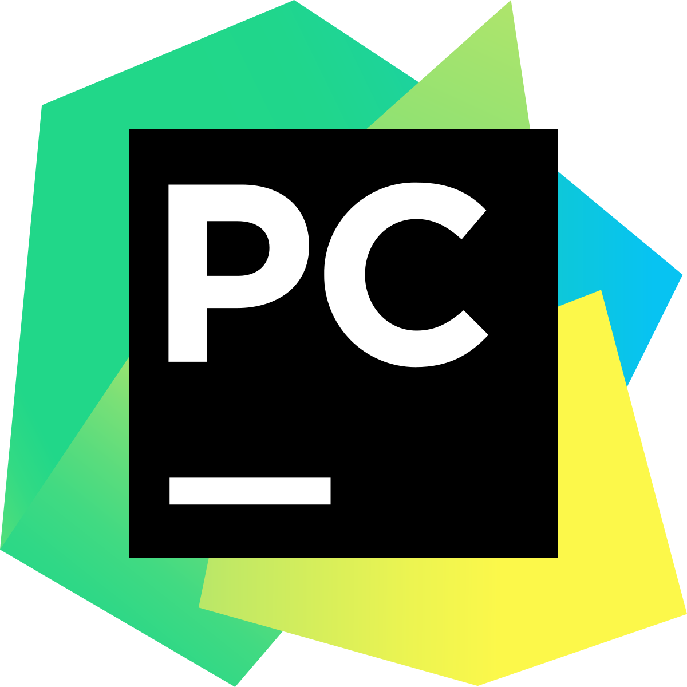
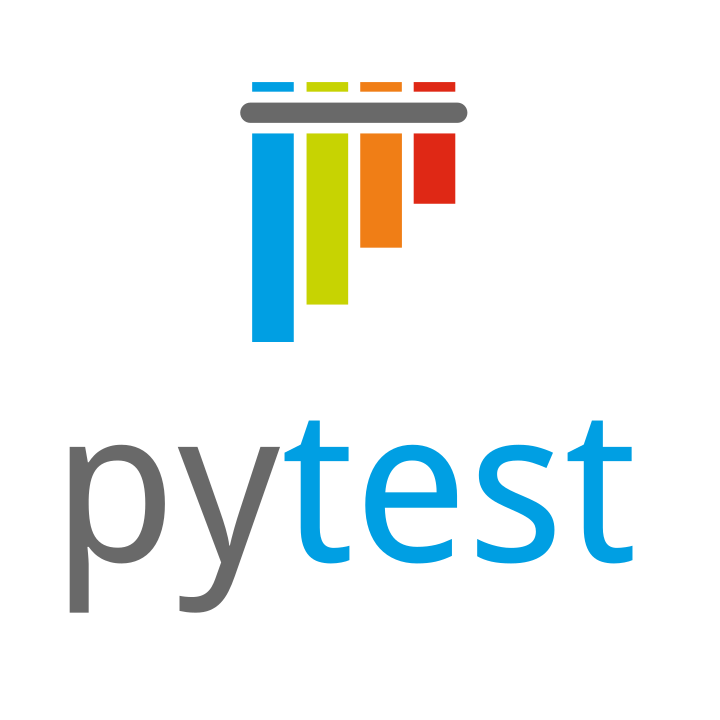
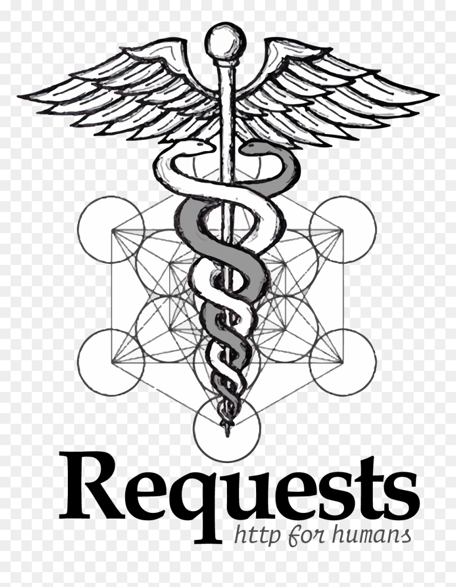
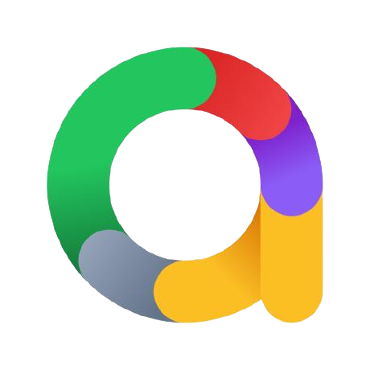
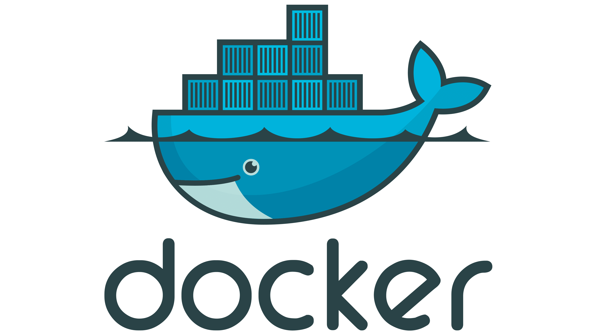

<h1 align="center"> Всем привет, я Надя </h1>
<h5 align="center"> Middle+ AQA в QA Studio 🧡 </h5>

* 🔥 5+ лет в тестировании
* 🐍 Пишу автотесты на Python
* ⚙️ Развиваюсь в автоматизации
* 📑 Опыт и навыки в **[резюме](https://career.habr.com/nadiaars)**
* 📞 Мои контакты: **[телеграм](https://t.me/nadia_ars)**, **[почта](nadia_ars@qa.studio)**

  

<h3 align="center"> Python </h3>

#### Мой стек:
| Python | PyCharm | Git | Pytest | Requests | Selenium | Allure Report | Docker | Gitlab CI | PostgreSQL |
|--------|---------|-----|--------|----------|----------|---------------|--------|-----------|----------|
|   |   || |  | | | | | |

#### Мои проекты:
| API My Shows Rating |  API Битва покемонов | UI Битва покемонов |
|---------------------|----------------------|--------------------|
|[my-shows-api-tests](https://github.com/nadiaars/my-shows-api-tests)|Ссылка на проект    | Ссылка на проект   
